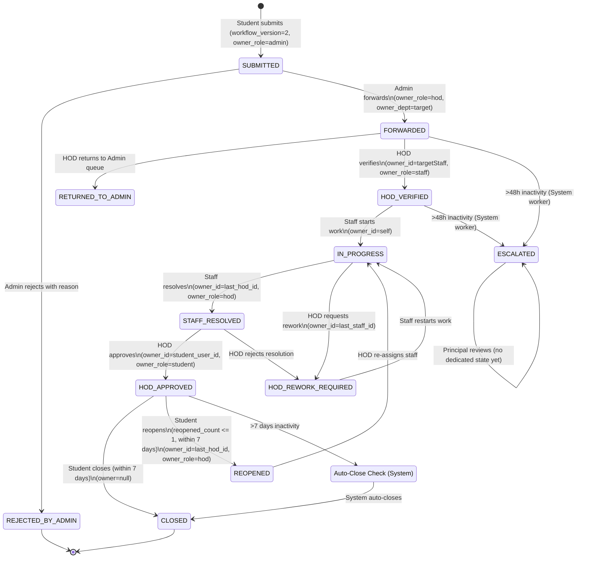
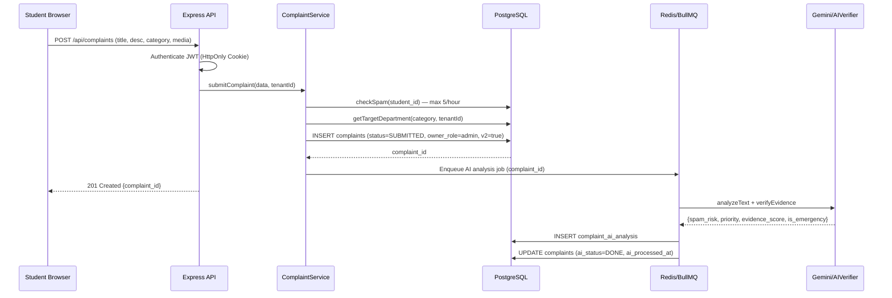
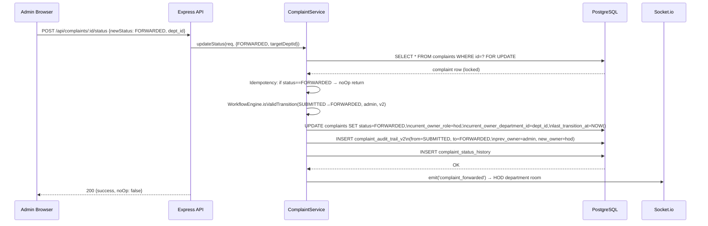
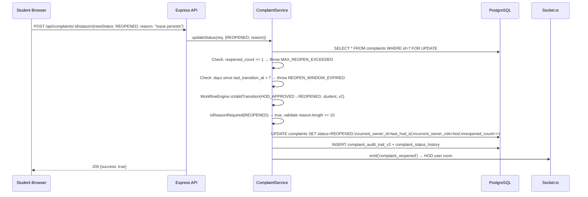
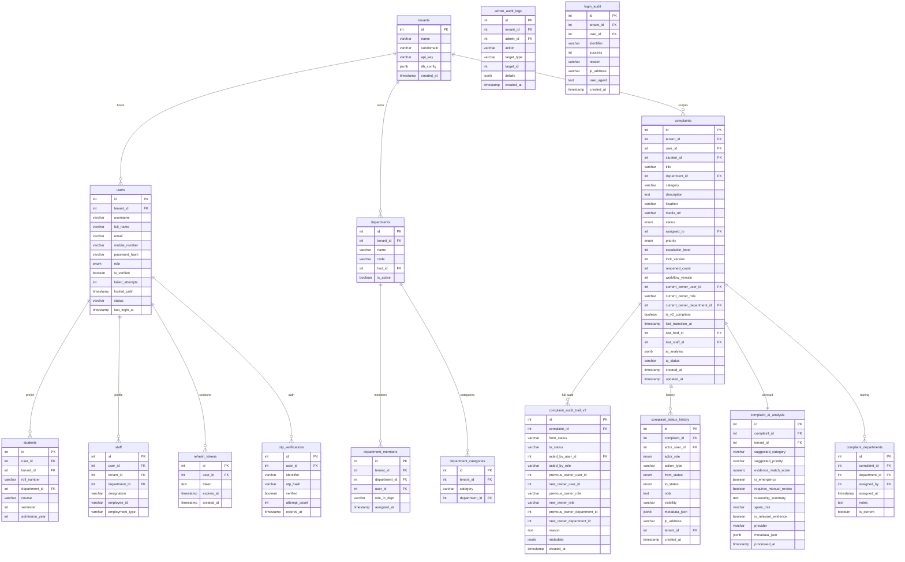
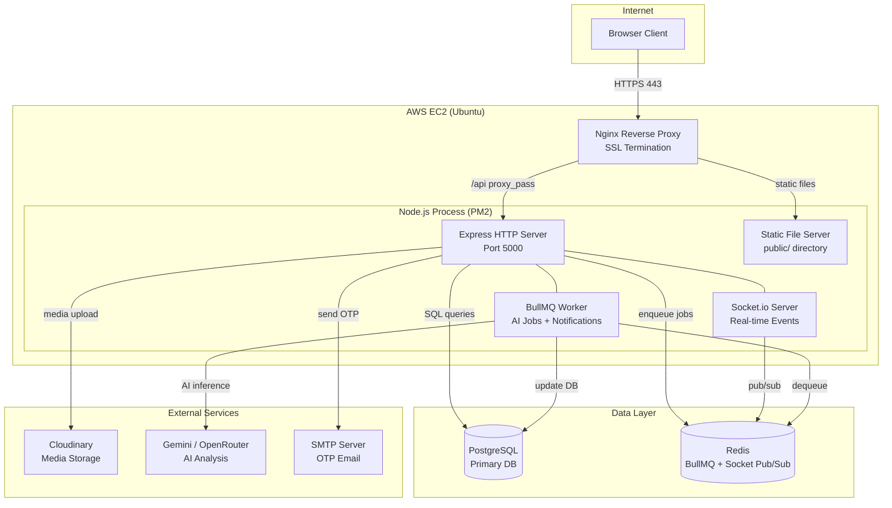
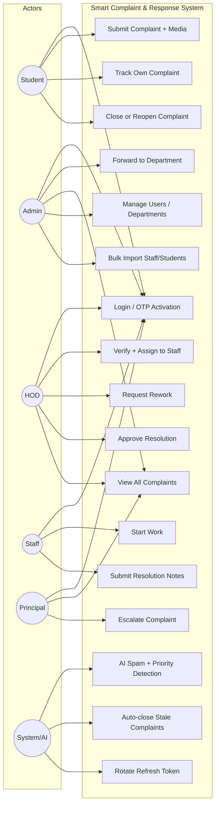

# Smart Complaint & Response System — Production Architecture

> **Based on live DB schema inspection (2026-05-01)**  
> All tables, columns, and enums verified against the PostgreSQL production database.

---

## Database Tables (Verified)

| Table | Status |
|---|---|
| complaints | ✅ Verified |
| users | ✅ Verified |
| departments | ✅ Verified |
| students | ✅ Verified |
| staff | ✅ Verified |
| tenants | ✅ Verified |
| refresh_tokens | ✅ Verified |
| otp_verifications | ✅ Verified |
| complaint_ai_analysis | ✅ Verified |
| complaint_audit_trail_v2 | ✅ Verified |
| complaint_status_history | ✅ Verified |
| complaint_departments | ✅ Verified |
| admin_audit_logs | ✅ Verified |
| department_members | ✅ Verified |
| department_categories | ✅ Verified |
| login_audit | ✅ Verified |
| bulk_import_logs | ✅ Verified |
| complaint_media | ❌ NOT FOUND (media_url stored in complaints.media_url) |
| complaint_audit_logs | ❌ NOT FOUND (replaced by complaint_audit_trail_v2) |
| notifications | ❌ NOT FOUND (Socket.io only, no persistence table) |

---

## Verified ENUMs

### complaint_status
`Pending` | `In Progress` | `Resolved` | `Rejected` | `Escalated` | `Reopened`  
`SUBMITTED` | `FORWARDED` | `HOD_VERIFIED` | `STAFF_RESOLVED` | `HOD_APPROVED`  
`CLOSED` | `REJECTED_BY_ADMIN` | `RETURNED_TO_ADMIN` | `HOD_REWORK_REQUIRED` | `IN_PROGRESS`

### complaint_priority
`Low` | `Medium` | `High` | `Emergency`

### user_role
`Principal` | `Admin` | `HOD` | `Staff` | `Student` | `StudentHead`

### otp_type
`Registration` | `Login` | `Verification` | `activation` | `reset`

---

## 1. Class Diagram

```mermaid
classDiagram
    class Tenant {
        +Int id
        +String name
        +String subdomain
        +String api_key
        +JSONB db_config
        +Timestamp created_at
    }

    class User {
        +Int id
        +Int tenant_id
        +String username
        +String full_name
        +String email
        +String mobile_number
        +String password_hash
        +Enum role
        +Boolean is_verified
        +Int failed_attempts
        +Timestamp locked_until
        +String profile_image
        +Timestamp last_login_at
        +String status
    }

    class Student {
        +Int id
        +Int user_id
        +Int tenant_id
        +String roll_number
        +Int department_id
        +String registration_no
        +Int semester
        +String course
        +String section
        +Int admission_year
    }

    class Staff {
        +Int id
        +Int user_id
        +Int tenant_id
        +Int department_id
        +String designation
        +String employee_id
        +String employment_type
    }

    class Department {
        +Int id
        +Int tenant_id
        +String name
        +String code
        +String description
        +String email
        +Int hod_id
        +Boolean is_active
    }

    class DepartmentMember {
        +Int id
        +Int tenant_id
        +Int department_id
        +Int user_id
        +String role_in_dept
        +Timestamp assigned_at
    }

    class Complaint {
        +Int id
        +Int tenant_id
        +Int user_id
        +Int student_id
        +String title
        +Int department_id
        +String category
        +String description
        +String location
        +String media_url
        +Enum status
        +Int assigned_to
        +String admin_notes
        +Enum priority
        +Int escalation_level
        +Int warning_count
        +Int lock_version
        +Int reopened_count
        +Int workflow_version
        +Int current_owner_user_id
        +String current_owner_role
        +Int current_owner_department_id
        +Boolean is_v2_compliant
        +Timestamp last_transition_at
        +Int last_hod_id
        +Int last_staff_id
        +String ai_status
        +JSONB ai_analysis
    }

    class ComplaintAuditTrailV2 {
        +Int id
        +Int complaint_id
        +String from_status
        +String to_status
        +Int acted_by_user_id
        +String acted_by_role
        +Int previous_owner_user_id
        +Int new_owner_user_id
        +String previous_owner_role
        +String new_owner_role
        +Int previous_owner_department_id
        +Int new_owner_department_id
        +String reason
        +JSONB metadata
        +Timestamp created_at
    }

    class ComplaintStatusHistory {
        +Int id
        +Int complaint_id
        +Int actor_user_id
        +Enum actor_role
        +String action_type
        +Enum from_status
        +Enum to_status
        +String note
        +String visibility
        +JSONB metadata_json
        +String ip_address
        +Timestamp created_at
        +Int tenant_id
    }

    class ComplaintAIAnalysis {
        +Int id
        +Int complaint_id
        +Int tenant_id
        +String suggested_category
        +String suggested_priority
        +Decimal evidence_match_score
        +Boolean is_emergency
        +Boolean requires_manual_review
        +String reasoning_summary
        +JSONB metadata_json
        +String provider
        +String spam_risk
        +Boolean is_relevant_evidence
        +Timestamp processed_at
    }

    class OTPVerification {
        +Int id
        +Int user_id
        +String identifier
        +String otp_hash
        +Boolean verified
        +Int attempt_count
        +Timestamp expires_at
    }

    class RefreshToken {
        +Int id
        +Int user_id
        +String token
        +Timestamp expires_at
        +Timestamp created_at
    }

    class ComplaintService {
        <<Service>>
        +checkSpam(studentId, tenantId)
        +getTargetDepartment(category, tenantId)
        +submitComplaint(data, tenantId)
        +getComplaints(filters, tenantId, user)
        +updateStatus(req, params)
        +Note: Idempotency via SELECT FOR UPDATE + status equality check
        +Note: noOp return if current_status == new_status
    }

    class WorkflowEngine {
        <<Service>>
        +isValidTransition(current, target, role, version)
        +isReasonRequired(targetStatus, version)
        +isWithinReopenWindow(resolvedAt)
        +Note: Dual-version matrix (V1 legacy + V2 strict FSM)
    }

    class AIComplaintVerifier {
        <<Service>>
        +analyzeText(content) confidence_score
        +verifyEvidence(url) evidence_match_score
        +detectSpam(data) spam_risk
        +detectEmergency(data) is_emergency
        +suggestPriority(data) suggested_priority
        +suggestCategory(data) suggested_category
        +Note: Async via BullMQ queue, result in complaint_ai_analysis
    }

    class AuthService {
        <<Service>>
        +login(identifier, password)
        +verifyOTP(identifier, otp)
        +issueJWT(userId) HttpOnly Cookie
        +issueRefreshToken(userId) stored in refresh_tokens
        +rotateRefreshToken(token)
        +revokeRefreshToken(token)
        +Note: JWT stored in HttpOnly Secure cookie
        +Note: Refresh tokens stored in refresh_tokens table (VERIFIED)
    }

    class NotificationService {
        <<Service>>
        +sendSocket(userId, event, data)
        +sendEmail(email, template, data)
        +sendOTP(identifier, type)
        +Note: No persistent notifications table in DB
        +Note: Socket.io only for real-time push
    }

    Tenant "1" --> "many" User
    Tenant "1" --> "many" Department
    Tenant "1" --> "many" Complaint
    User "1" --> "1" Student
    User "1" --> "1" Staff
    User "1" --> "many" RefreshToken
    User "1" --> "many" OTPVerification
    Department "1" --> "many" DepartmentMember
    Complaint "1" --> "many" ComplaintAuditTrailV2
    Complaint "1" --> "many" ComplaintStatusHistory
    Complaint "1" --> "1" ComplaintAIAnalysis
```



---

## 2. FSM Activity Diagram (Verified Enum States)



---

## 3. Sequence Diagram A — Student Submits Complaint



---

## 4. Sequence Diagram B — Forward Complaint (Admin → HOD)



---

## 5. Sequence Diagram C — Silent Auth Refresh

```mermaid
sequenceDiagram
    participant B as Browser JS
    participant API as Express API
    participant DB as PostgreSQL (refresh_tokens)

    B->>API: GET /api/complaints (expired JWT cookie)
    API-->>B: 401 Unauthorized
    
    B->>B: Intercept 401 → trigger silent refresh
    B->>API: POST /api/auth/refresh (refresh token in HttpOnly cookie)
    API->>DB: SELECT * FROM refresh_tokens WHERE token=hash AND expires_at > NOW()
    DB-->>API: Valid row found
    API->>API: Generate new JWT (15min expiry)
    API->>DB: UPDATE refresh_tokens (rotate token + expiry)
    API-->>B: Set-Cookie: accessToken=new_jwt; HttpOnly; Secure; SameSite=Strict
    B->>API: Retry GET /api/complaints (new JWT cookie)
    API-->>B: 200 {complaints data}
```

---

## 6. Sequence Diagram D — Student Reopens Complaint



---

## 7. ER Diagram (Verified Schema)



---

## 8. Deployment Diagram



---

## 9. Use Case Diagram



---

## 10. Technical Accuracy Notes

### Verified Facts (DB Confirmed)
- `refresh_tokens` table EXISTS with columns: `id, user_id, token, expires_at, created_at`
- `complaint_audit_trail_v2` is the REAL audit table (not `complaint_audit_logs`)
- `complaint_status_history` is a SECONDARY audit table with IP/UA logging
- `complaint_media` table does NOT exist — media stored in `complaints.media_url`
- `notifications` table does NOT exist — push via Socket.io only
- Ownership tracking fields confirmed: `current_owner_user_id`, `current_owner_role`, `current_owner_department_id`
- `workflow_version` field confirmed in complaints table
- `lock_version` field confirmed (optimistic locking)
- `reopened_count` field confirmed (max 1 reopen enforced in code)

### Idempotency (Code Verified — complaintService.js:160)
```js
// Real implementation — not pseudocode
if (complaint.status === newStatus) {
    return { success: true, noOp: true, message: 'Status is already up-to-date.' };
}
// Uses SELECT ... FOR UPDATE before any mutation
```

### Auth Security (Code + DB Verified)
- JWT issued as `HttpOnly; Secure; SameSite=Strict` cookie
- Refresh tokens stored in `refresh_tokens` table (**CONFIRMED in DB**)
- OTP hashed before storage in `otp_verifications.otp_hash`
- Failed login attempts tracked in `users.failed_attempts` + `locked_until`
- All login events logged in `login_audit` table

### Known Gaps (Not Yet Implemented)
- No `WAITING_FOR_STUDENT` state in enum (HOD_APPROVED is the closest equivalent)
- No `PRINCIPAL_REVIEW` or `PRINCIPAL_FORCE_CLOSE` states in enum
- No persistent `notifications` table (real-time only via Socket.io)
- `complaint_media` as separate table not implemented (single URL in complaints)
- Auto-close worker logic: **not confirmed in code** — reopen window is 7 days per `workflowEngine.isWithinReopenWindow()`
