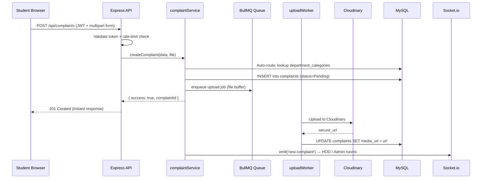

# Smart Campus Response System — Architecture Overview

## System Overview

A **multi-tenant SaaS** complaint management platform for educational institutions. Students submit complaints via a web portal; the system auto-routes them to the correct department, notifies staff, and provides real-time dashboards for all roles.

---

## High-Level Architecture

```mermaid
flowchart TD
    subgraph Client["Browser (Vanilla JS + GSAP)"]
        S[Student Portal]
        A[Admin Dashboard]
        H[HOD Dashboard]
        P[Principal Dashboard]
    end

    subgraph API["Node.js / Express API  (PM2 Cluster)"]
        MW[Auth + Rate Limit Middleware]
        R_Auth[/api/auth]
        R_Comp[/api/complaints]
        R_Dash[/api/dashboards]
        R_Admin[/api/admin]
        R_Health[/api/health]
        R_Queue[/admin/queues — BullBoard]
    end

    subgraph Services["Service Layer"]
        AuthSvc[authService]
        CompSvc[complaintService]
        CacheSvc[cacheService — Redis]
        EscSvc[escalationService]
        NotifySvc[notificationService]
        OTPSvc[otpService]
    end

    subgraph Workers["Background Workers  (PM2 × 2)"]
        UW[uploadWorker — Cloudinary]
        NW[notificationWorker — Email/SMS]
    end

    subgraph Queues["BullMQ Queues  (Redis)"]
        UQ[(uploads queue)]
        NQ[(notifications queue)]
    end

    subgraph Storage["Persistence"]
        MySQL[(MySQL — smart_campus_db)]
        Cloudinary[(Cloudinary CDN)]
        Logs[(File Logs — Winston)]
    end

    Client -->|HTTPS / JWT| MW
    MW --> R_Auth & R_Comp & R_Dash & R_Admin & R_Health
    R_Auth --> AuthSvc
    R_Comp --> CompSvc
    CompSvc --> CacheSvc
    CompSvc -->|enqueue upload| UQ
    CompSvc -->|enqueue notification| NQ
    UQ --> UW --> Cloudinary
    NQ --> NW
    Services --> MySQL
    API -->|Socket.io events| Client
    R_Health -->|SELECT 1| MySQL
```

---

## Component Descriptions

| Component | Technology | Responsibility |
|---|---|---|
| **Frontend** | HTML, Vanilla JS, GSAP, Chart.js | Responsive dashboards, media preview, real-time updates via Socket.io |
| **API Server** | Node.js + Express | REST API, JWT auth, rate limiting, CORS, static file serving |
| **Auth Middleware** | `jsonwebtoken`, bcrypt | Verifies access tokens, extracts `tenant_id` + `role` from payload |
| **Service Layer** | `services/` | Business logic — complaint lifecycle, auto-routing, pagination, caching |
| **Queue System** | BullMQ + Redis | Async media upload & email/SMS notification jobs with DLQ fallback |
| **Background Workers** | `workers/` (PM2 × 2) | Consume BullMQ jobs; retry up to 5×, exponential backoff |
| **Database** | MySQL (XAMPP / Azure) | Multi-tenant schema (`tenant_id` on every table), strict FK constraints |
| **Cache** | Redis (`cacheService`) | Caches departments + categories; avoids repeated DB reads |
| **File Storage** | Cloudinary | Stores complaint images/videos; URLs saved in `complaints.media_url` |
| **Logging** | Winston | Rotating daily log files in `logs/`; Morgan HTTP access log stream |
| **Monitoring** | BullBoard at `/admin/queues` | Live queue depth, job counts, failed job inspection |
| **Health Check** | `GET /api/health` | DB ping, Redis status, uptime, heap memory for load balancers |

---

## Data Flow: Complaint Submission



---

## Multi-Tenancy Model

- **Shared schema**: every table has a `tenant_id` (INT, FK → `tenants.id`).
- All queries are scoped with `WHERE tenant_id = ?` using the value extracted from the JWT.
- `tenant_id` is set at registration time and embedded in the access token — no per-request header needed.

---

## Security Layers

| Layer | Mechanism |
|---|---|
| Transport | HTTPS via Nginx + Let's Encrypt |
| Authentication | Short-lived JWT (15 min) + Refresh Token rotation |
| Authorization | RBAC via `checkRole` middleware |
| Rate Limiting | Global 100 req/15 min (production); complaint-specific 5/hr |
| Input Validation | `express-validator` + XSS sanitization (`sanitizeHtml`) |
| Audit Logging | All login attempts written to `login_audit` table |
| Account Lockout | 5 failed logins → locked until cool-down expires |

---

## File Structure Reference

```
smart_complaint_&_resonse_system/
├── server.js               — Application entry point
├── ecosystem.config.cjs    — PM2 cluster configuration
├── nginx.conf.template     — Nginx HTTPS reverse proxy template
├── routes/                 — Express routers (auth, complaints, health…)
├── controllers/            — HTTP handlers
├── services/               — Business logic (authService, complaintService)
├── workers/                — BullMQ job processors
├── utils/                  — Shared utilities (logger, cache, queue, socket)
├── middleware/             — Auth, RBAC, validators, rate-limit
├── config/                 — DB pool, Redis client
├── public/                 — Frontend HTML/CSS/JS
├── scripts/                — DB migrations & seed scripts
└── docs/                   — This document + deployment guides
```
